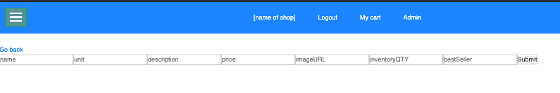

# JAR

_A Grace Shopper group project by Josh, Andres, and Robert._

JAR is a toy e-commerce website where visitors can browse essential goods during the stay-at-home period.

## Getting Started

You must have postgreslq installed before running the application locally. Setup for psql can be found [here](https://postgresapp.com/).<br>
In your terminal, enter the following and go to [localhost:8080](http://localhost:8080/) to begin interacting with JAR.

```
npm i
npm run seed
npm run start-dev
```

Alternatively, you can view a deployed version on heroku [here](https://gs-jar.herokuapp.com/).

## Using JAR

When browsing throughout the site, users can view goods altogether, separated by brands, or separated by departments by clicking the hamburger icon at the top left.


When logged in as an admin user, an Admin link appears in the nav bar on the top. Through this link, admin users will have the ability to perform POST and PUT requests for products.




## For Developers

Instead of viewing the site through our beautiful user interface, one can also access certain parts of the site through our API


_More to come_
